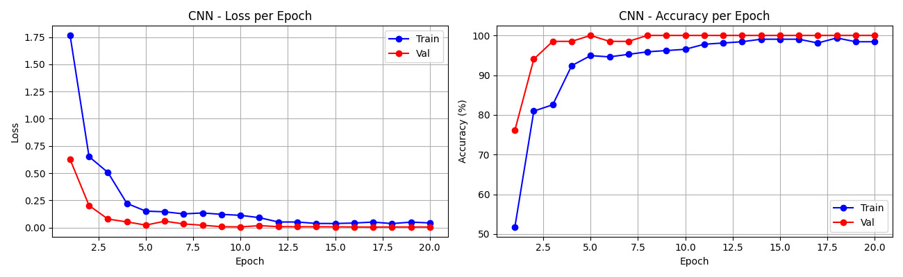
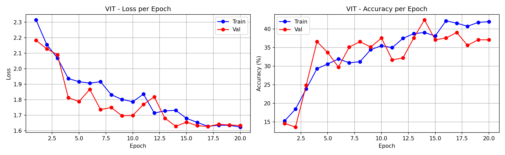
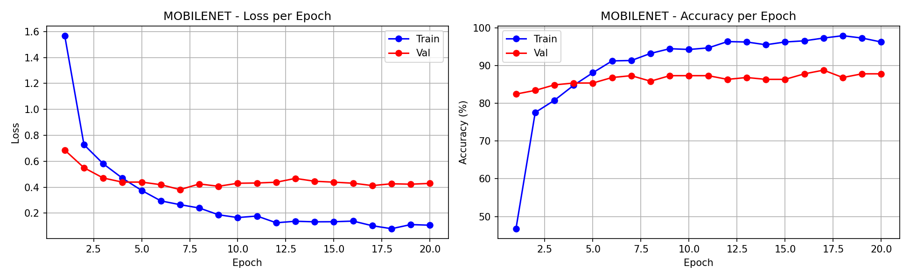
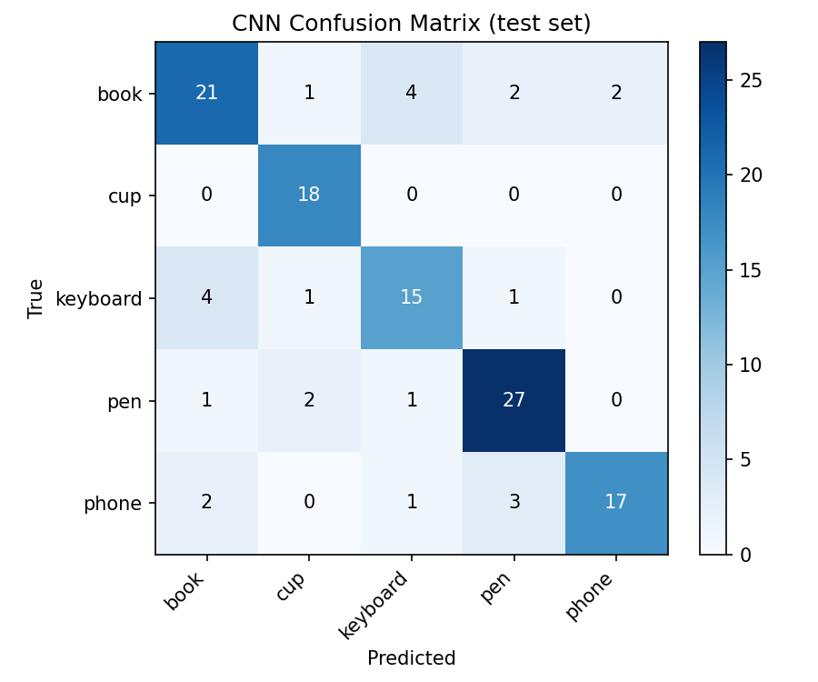
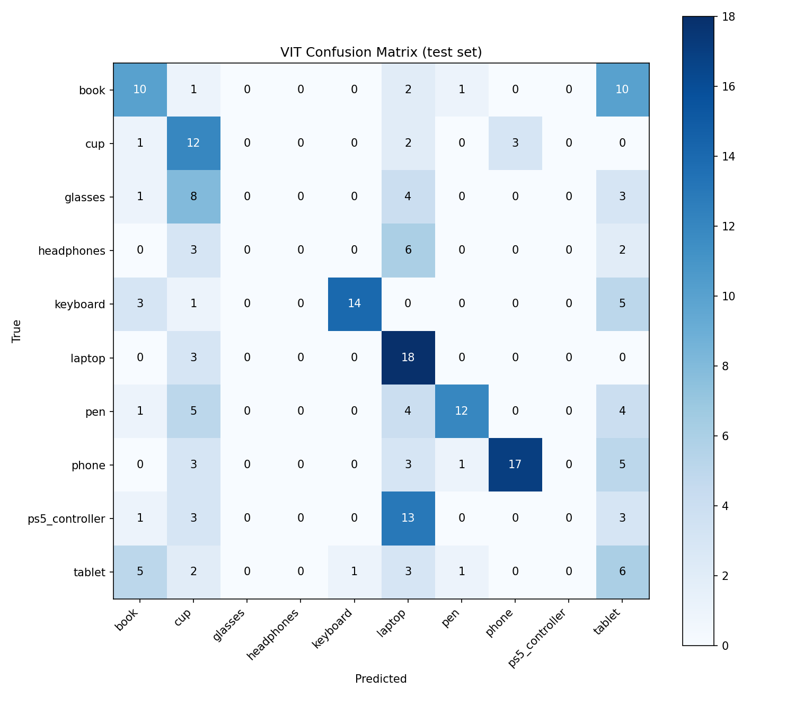
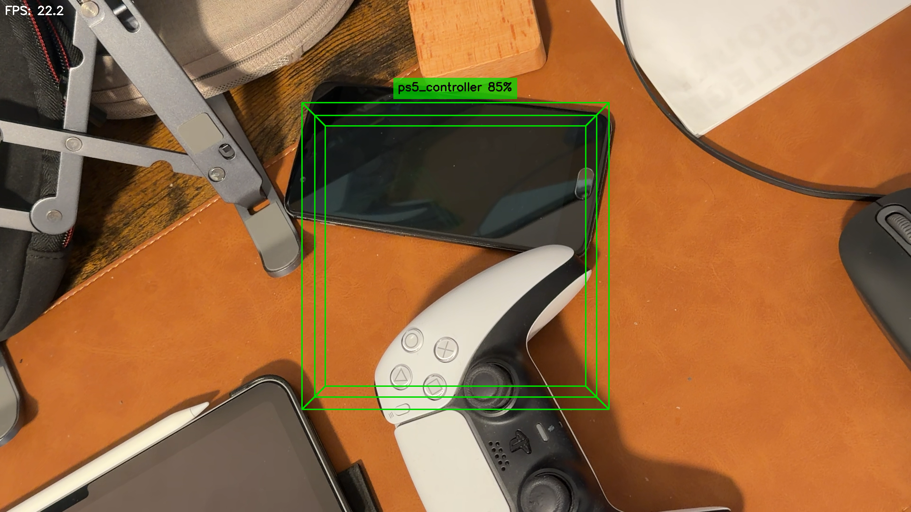

# CS5330 Final Project Report
## Real-Time Object Recognition and Augmented Reality Fusion

**Students:** Sangeeth Deleep Menon (NUID: 002524579) and Raj Gupta (NUID: 002068701)
**Program:** MSCS Boston, Section 03 (CRN 40669, Online)
**Course:** CS5330 Pattern Recognition and Computer Vision, Spring 2026

---

## 1. Project Overview

The goal of this project was to build a real-time system that looks at a live webcam feed, recognizes everyday objects, and draws a 3D augmented reality overlay on top of whatever it sees. The idea came from combining two earlier assignments in the course. Project 4 covered how to render 3D graphics on top of a physical scene using a chessboard as a calibration target. Project 5 covered how to train a convolutional neural network to classify images. The natural question was whether those two ideas could work together without needing a printed marker at all.

The answer is yes. In this system, any object the network has learned to recognize becomes its own AR anchor. When the classifier identifies an object with enough confidence, the system draws a 3D wireframe box around it and places a floating label tag above it showing the class name and confidence score. Two additional mechanisms make the live experience more reliable: a temporal smoothing buffer that prevents the label from flickering between frames, and an entropy-based rejection step that lets the system display "Unknown" when no familiar object is in view. Everything runs in real time on a standard laptop.

---

## 2. Dataset

The dataset covers 10 everyday object classes. The original 5 classes were book, cup, keyboard, pen, and phone, collected using a webcam capture tool built as part of the project. Five more classes were added later: glasses, headphones, laptop, ps5_controller, and tablet, downloaded from the web using a Bing image crawler.

The final dataset has 1419 images across the 10 classes.

| Class | Images |
|---|---|
| book | 161 |
| cup | 173 |
| glasses | 130 |
| headphones | 110 |
| keyboard | 152 |
| laptop | 123 |
| pen | 171 |
| phone | 159 |
| ps5_controller | 102 |
| tablet | 138 |

All images were split into 70% for training, 15% for validation, and 15% for testing using a fixed random seed for reproducibility. Training images were augmented with random horizontal and vertical flips, color jitter, random perspective distortion, random grayscale, random erasing, and rotations up to 25 degrees. Validation and test images were not augmented.

The two groups of classes differ in data quality. The first five have webcam photos taken in consistent conditions with the object centered in frame. The later five rely entirely on web images, which vary more in background, angle, and lighting. This difference has a measurable impact on accuracy.

---

## 3. Model Architectures

Three architectures were implemented and compared.

### 3.1 ObjectCNN

ObjectCNN is a three-layer convolutional neural network trained from scratch. It takes a 64x64 RGB image as input. Each convolutional layer is followed by batch normalization, a ReLU activation, and a max pooling step that halves the spatial dimensions. After the third pooling step the feature maps are flattened into a vector of 8192 values, passed through a fully connected layer with 256 neurons and 40% dropout, and then through the output layer.

Batch normalization was added after each convolution to stabilize training on the small dataset. Dropout on the fully connected layer helps with overfitting.

### 3.2 ObjectViT

ObjectViT is a minimal Vision Transformer trained from scratch. It takes the same 64x64 RGB input and splits it into non-overlapping 8x8 patches, giving 64 patches per image. Each patch is projected into a 128-dimensional embedding. A learnable class token is prepended to the sequence, and learned positional embeddings are added before the sequence goes into four transformer encoder layers. Each layer has 4 attention heads and a feed-forward dimension of 512. After the transformer stack, the class token output is passed through a linear head to produce the final class scores.

The ViT was trained from scratch without pretrained weights. On small datasets this is a disadvantage because transformers need a lot of data to learn useful attention patterns. The ViT converged slower than the CNN on the same training set.

### 3.3 MobileNetV2

MobileNetV2 is a network pretrained on ImageNet. The backbone was loaded with its ImageNet weights and the final classification head was replaced with a new linear layer sized for 10 classes, preceded by 30% dropout. The backbone was not frozen during training so it could adapt to the new classes with a lower learning rate.

Because the backbone already knows how to detect edges, textures, and shapes from a large image collection, it needs far fewer examples to generalize to new classes. MobileNetV2 takes 224x224 inputs rather than the 64x64 used by the other two models. It was chosen as the final deployed model because it consistently outperformed the other two on the 10-class dataset.

---

## 4. Training

All models were trained using the Adam optimizer with a cosine annealing learning rate schedule for 20 epochs. The best checkpoint by validation accuracy was saved and used for final evaluation.

### 4.1 CNN Training (5 classes)

The CNN trained on the 5-class webcam dataset reached a test accuracy of 79.7%. Validation accuracy plateaued around 68% with the best checkpoint saved at epoch 14. The gap between validation and test accuracy is mainly a product of small split sizes. With roughly 120 samples in each held-out partition, a single seed can produce a test split that is slightly easier or harder than the validation split, moving the numbers a few points in either direction.

### 4.2 ViT Training (10 classes)

The Vision Transformer was trained from scratch on all 10 classes. It reached a test accuracy of 43.2%, with a mean epoch time of 14.2 seconds on Apple MPS. Three classes, glasses, headphones, and ps5_controller, received near-zero precision in the confusion matrix, meaning the model rarely predicted them correctly. This is expected behavior for a transformer trained without pretrained weights on a dataset of roughly 1000 samples. Transformers need substantially more data than CNNs to develop useful attention patterns from random initialization.

### 4.3 MobileNet Training (10 classes)

MobileNetV2 on all 10 classes showed steady improvement through the first 7 epochs, with validation accuracy reaching 88.8% at its peak. Training accuracy continued climbing past 97% while validation accuracy leveled off, showing mild overfitting in the later epochs. The validation loss plateaued around 0.4, consistent with the accuracy curves.

---

## 5. Results

### 5.1 CNN Results (5 Classes)

The CNN achieved 79.7% test accuracy on the 5-class held-out set. The confusion matrix shows some errors between visually similar classes, particularly at varying scales and distances.

### 5.2 ViT Results (10 Classes)

The Vision Transformer reached 43.2% test accuracy on the 10-class held-out set. The confusion matrix is heavily skewed, with most predictions concentrated in a small number of bins. Glasses, headphones, and ps5_controller show near-zero precision. The result is consistent with the known difficulty of training transformers from scratch on small datasets and confirms that pretraining is not optional for this task.

### 5.3 MobileNetV2 Results (10 Classes)

MobileNetV2 achieved 88.8% overall test accuracy on the 10-class held-out set.

| Class | Precision | Recall |
|---|---|---|
| book | 95.2% | 83.3% |
| cup | 85.7% | 100.0% |
| glasses | 87.5% | 87.5% |
| headphones | 100.0% | 63.6% |
| keyboard | 92.0% | 100.0% |
| laptop | 89.5% | 81.0% |
| pen | 92.0% | 88.5% |
| phone | 87.5% | 96.6% |
| ps5_controller | 95.0% | 95.0% |
| tablet | 70.0% | 77.8% |
| **Mean** | **89.4%** | **87.3%** |

Strong performers include cup and keyboard at 100% recall, and headphones at 100% precision. Glasses improved significantly to 87.5% on both metrics under MobileNetV2, compared to near-zero precision under the from-scratch ViT, showing the pretrained backbone learned to distinguish eyeglasses despite the noisy web crawl data. Tablet remained the weakest class at 70% precision, as flat rectangular devices are hard to separate from phones and laptops at certain angles.

---

## 6. AR System

### 6.1 How the AR Overlay Works

The AR system processes one webcam frame at a time. A square region of interest is cropped from the center of the frame, resized to 224x224, and passed through MobileNetV2. Before drawing any overlay, two checks run.

First, a 5-frame majority-vote buffer takes the most common predicted class over the last five frames. This prevents the label from flickering when the model is near a decision boundary.

Second, an entropy-based rejection step computes the normalized Shannon entropy of the softmax probability distribution. When the distribution is too flat, meaning the model is genuinely uncertain about everything in the frame, the system shows "Unknown" instead of guessing. This removes the need for a dedicated background class while still letting the system abstain on unfamiliar scenes.

If the top class passes both checks and exceeds the confidence threshold, the 3D overlay is drawn using a fixed-depth pinhole camera model. The camera matrix is estimated from the frame dimensions with focal length set to 0.85 times the longer dimension. The object is assumed to sit at 0.5 meters depth. From that assumption and the pixel size of the ROI, the physical dimensions of the box are computed using the standard pinhole projection formula. Box depth is set to 45% of the smaller of those two dimensions.

The 8 corners of the 3D box are projected back into pixel coordinates using cv2.projectPoints with the identity rotation and translation. The 12 edges are drawn as colored lines with each class assigned a unique color. A semi-transparent label tag is placed above the top edge of the front face showing the class name and confidence percentage.

### 6.2 Live Performance

The system runs at approximately 20 to 30 frames per second during live testing on an Apple Silicon MacBook with MPS acceleration. This is above the 15 FPS minimum needed for a smooth interactive experience.

### 6.3 AR Screenshot

The screenshot below was captured during a live session.

The center ROI contains a PS5 DualSense controller as the dominant object and the model predicts ps5_controller at 85% confidence. The green 3D wireframe box is anchored to the ROI with visible front and back faces connected by pillars. The label tag reads "ps5_controller 85%" and is positioned above the front face. The controller is one of the web-only classes, so a confident correct prediction at 85% reflects the strength of the retrained MobileNetV2 backbone on images it was not explicitly fine-tuned on.

---

## 7. Limitations

**Fixed center ROI.** The system only classifies what appears in a fixed square at the center of the frame. If the object is off to the side it will not be detected. A proper object detector like YOLO would solve this.

**Fixed depth assumption.** The 3D box is back-projected assuming the object is always 0.5 meters away. At other distances the box will look incorrectly sized relative to the actual object.

**Single object.** Multiple objects in frame are not handled. The system only classifies whatever is in the center region.

Two common failure modes have been addressed in this version. Prediction flickering is handled by the 5-frame majority-vote buffer. The lack of a background class is handled by entropy-based rejection.

---

## 8. Connections to Prior Projects

This project builds directly on two earlier assignments. The AR rendering pipeline comes from Project 4, adapted to work without any physical target by using the object bounding box as the pose reference and a fixed-depth assumption in place of a solved pose.

The deep learning components come from Project 5, which trained CNNs and Vision Transformers on MNIST and Greek letter datasets. ObjectCNN follows the same structure as the Project 5 CNN but adapted for color images at 64x64 instead of grayscale at 28x28, with batch normalization added to stabilize training. ObjectViT follows the same transformer design from Project 5 Task 4.

The addition of MobileNetV2 with transfer learning goes beyond what was covered in the course and was necessary to achieve strong accuracy on the 10-class dataset with limited training data.

---

## 9. Conclusion

This project produced a working real-time markerless AR system that met and extended the original goals. The final MobileNetV2 model achieves 88.8% accuracy across 10 object classes and the full pipeline runs at 20 to 30 FPS with no printed calibration target required. Temporal smoothing and entropy-based rejection make the live experience noticeably more stable and honest. The work connects the AR rendering from Project 4 and the deep learning from Project 5 in a way that makes each more useful than it was on its own.
