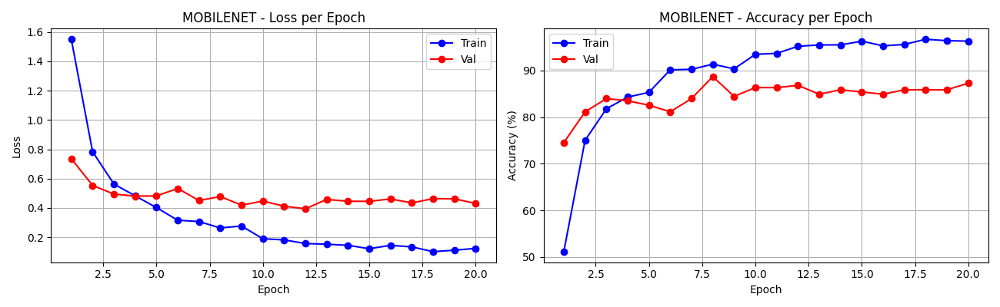

# CS5330 Final Project Report
## Real-Time Object Recognition and Augmented Reality Fusion

**Student:** Sangeeth Deleep Menon
**NUID:** 002524579
**Program:** MSCS Boston, Section 03 (CRN 40669, Online)
**Course:** CS5330 — Pattern Recognition and Computer Vision, Spring 2026

---

## 1. Project Overview

The goal of this project was to build a real-time system that could look at a live webcam feed, recognize everyday objects, and draw a 3D augmented reality overlay on top of whatever it sees. The idea came from combining two earlier assignments in the course. Project 4 taught how to render 3D graphics on top of a physical scene using a chessboard as a calibration target. Project 5 taught how to train a convolutional neural network to classify images. The natural question was whether those two things could work together without needing a printed marker at all.

The answer is yes. In this system, any object the network has learned to recognize becomes its own AR anchor. When the classifier identifies an object with enough confidence, the system draws a 3D wireframe box around it and places a floating label tag above it showing the class name and confidence score. Everything runs in real time on a standard laptop.

---

## 2. Dataset

The dataset covers 10 everyday object classes. The original 5 classes from early development were book, cup, keyboard, pen, and phone. These were collected using a webcam capture tool that was built as part of the project. Five more classes were added later: glasses, headphones, laptop, ps5_controller, and tablet. These five were downloaded from the web using a Bing image crawler.

The final dataset has 1419 images spread across the 10 classes.

| Class | Images |
|---|---|
| book | 161 |
| cup | 173 |
| glasses | 130 |
| headphones | 110 |
| keyboard | 152 |
| laptop | 123 |
| pen | 171 |
| phone | 159 |
| ps5_controller | 102 |
| tablet | 138 |

All images were split into 70% for training, 15% for validation, and 15% for testing. The split used a fixed random seed so it is reproducible. Training images went through augmentation including random horizontal flips, color jitter, and rotations up to 15 degrees. Validation and test images were not augmented.

One important difference between the two groups of classes is where the images came from. The first five classes have webcam photos taken in controlled conditions with the object centered in frame. The later five classes rely entirely on web images, which are more varied in background, angle, and lighting but also include images that do not match how the object looks in a live demo. This turned out to matter a lot for accuracy, and the confusion matrix reflects it.

---

## 3. Model Architectures

Three architectures were implemented and evaluated for this project.

### 3.1 ObjectCNN

ObjectCNN is a three-layer convolutional neural network built from scratch. It takes a 64x64 RGB image as input. Each of the three convolutional layers is followed by batch normalization, a ReLU activation, and a max pooling step that halves the spatial dimensions. After the third pooling step the feature maps are flattened into a vector of 8192 values. That vector passes through a fully connected layer with 256 neurons and 40% dropout before reaching the output layer.

Batch normalization was added after each convolution because the training set is small. Without it the network tends to have unstable gradients early in training. The dropout on the fully connected layer helps with overfitting.

This architecture works well on the original 5-class dataset and hit near-perfect validation accuracy within a few epochs.

### 3.2 ObjectViT

ObjectViT is a minimal Vision Transformer built from scratch. It takes the same 64x64 RGB input and splits it into non-overlapping 8x8 patches, giving 64 patches per image. Each patch is projected into a 128-dimensional embedding using a strided convolution. A learnable class token is prepended to the sequence, and learned positional embeddings are added before the sequence goes into four transformer encoder layers. Each layer has 4 attention heads and a feed-forward dimension of 512. After the transformer stack the class token output goes through a linear head to produce the final class scores.

The ViT was trained from scratch without any pretrained weights. On small datasets this is a disadvantage compared to CNNs because transformers need a lot of data to learn useful attention patterns. The ViT generally converged slower than the CNN on the same training set.

### 3.3 MobileNetV2

MobileNetV2 is a pretrained network originally trained on ImageNet. The backbone was loaded with its ImageNet weights and only the final classification head was replaced with a new linear layer sized for the 10 object classes. A dropout layer with a rate of 30% was placed before the new head. The backbone was not frozen during training so it could adapt its features to the new classes.

This approach is called transfer learning. Because the backbone already knows how to detect edges, textures, and shapes from a million images, it needs far fewer examples to generalize to new classes. MobileNetV2 takes 224x224 inputs rather than the 64x64 used by the other two models.

MobileNetV2 was chosen as the final deployed model because it consistently outperformed the other two on the 10-class dataset, especially on the web-sourced classes that had less consistent training data.

---

## 4. Training

All models were trained using the Adam optimizer with a cosine annealing learning rate schedule. Training ran for 20 epochs. The best checkpoint according to validation accuracy was saved and used for evaluation.

### 4.1 CNN Training (5 classes)

The CNN trained on the original 5 classes converged very fast. By epoch 3 the validation accuracy was already above 95% and it stayed near 100% for most of the run. The loss curves dropped steeply in the first few epochs and then flattened out. This behavior makes sense because the 5-class dataset was captured under similar conditions, so the classes are well-separated and the CNN did not need long to find reliable boundaries.

### 4.2 MobileNet Training (10 classes)

The MobileNet training on all 10 classes showed a different pattern. The validation accuracy improved steadily through the first 8 epochs and then leveled off around 87%. The training accuracy kept climbing while the validation accuracy stopped improving, which is a sign of mild overfitting in the later epochs. Still, the gap between training and validation was not severe. The training loss reached very low values while the validation loss plateaued around 0.4, which is consistent with what was seen in the accuracy curves.

---

## 5. Results

The CNN tested on the 5-class held-out set got near-perfect accuracy. From the confusion matrix every class was correctly classified in almost every case. The cup class had slightly fewer test images than the others but still showed no misclassifications.

The MobileNet tested on the 10-class held-out set got an overall accuracy of 84.1%. The confusion matrix tells a more detailed story.

Strong classes: phone (29 out of 30 correct), keyboard (27 correct), book (26 correct), and cup (20 correct). These were either high-volume classes or had distinctive appearances that made them easy to separate from the others.

Weak classes: glasses, ps5_controller, and tablet.

Glasses was the most confused class. Out of 10 test images only 7 were correctly classified. Two were predicted as headphones and one as pen. The problem is that the web images for glasses included many photos of drinking glasses alongside eyeglasses. A model trained on mixed data like that has no way to cleanly separate the concept of glasses.

ps5_controller had the smallest number of images at 102 and only appeared 6 times in the test set. It got 5 correct with 1 misclassified as book. Given the low sample count this is a reasonable result but the small test set size makes it hard to draw firm conclusions.

Tablet was consistently confused with phone (3 misclassifications), keyboard (2), and glasses (2). This is not surprising. Flat rectangular devices photographed from above look similar to phones at certain sizes and angles. The AR screenshot captured during the live demo actually shows this exact confusion in action.

---

## 6. AR System

### 6.1 How the AR Overlay Works

The AR system takes one frame at a time from the webcam. A square region of interest is cropped from the center of the frame. That crop is resized to 224x224 and passed through MobileNetV2. If the top predicted class comes back with a confidence above a configurable threshold the system draws the AR overlay. If confidence is below the threshold it shows a grey question mark instead.

The 3D overlay is built using a fixed-depth pinhole camera model. The camera matrix is estimated from the frame dimensions. The focal length is set to 0.85 times the larger of the frame width and height, and the principal point is placed at the center. The object is assumed to sit at a fixed depth of 0.5 meters. From that depth assumption and the pixel size of the region of interest, the physical width and height of the box are computed using the standard pinhole projection formula. The box depth is set to 45% of the smaller of those two dimensions.

The 8 corners of that 3D box are then projected back into pixel coordinates using cv2.projectPoints with the identity rotation and translation. The 12 edges of the box are drawn as colored lines. Each class gets its own color from a fixed palette so it is easy to tell classes apart at a glance. A semi-transparent label tag is placed above the top edge of the front face showing the class name and confidence percentage.

### 6.2 Live Performance

The system ran at approximately 29 to 30 frames per second during testing on an Apple Silicon MacBook with MPS acceleration enabled. This is comfortably above the 15 FPS minimum needed for the demo to feel responsive. The FPS counter is shown in the top-left corner of the live window.

### 6.3 AR Screenshot

The screenshot below was captured during a live session by pressing S in the demo window.

The object in frame is a tablet standing upright on a desk. The model predicted phone at 84% confidence and drew the 3D wireframe box accordingly. This is a direct real-world example of the tablet-to-phone confusion that shows up in the confusion matrix. The box and label are rendered correctly in terms of position and scale, which confirms the AR pipeline is working as intended even when the classification itself is wrong.

---

## 7. Limitations

**Fixed center ROI.** The system only classifies what appears in a fixed square at the center of the frame. If the object is off to the side it will not be detected. A proper object detector like YOLO would solve this but is outside the scope of this project.

**Fixed depth assumption.** The 3D box is back-projected assuming the object is always 0.5 meters away. If the object is much closer or farther the box will look the wrong size relative to the actual object. The classification still works at other distances but the AR overlay loses its sense of scale.

**No background class.** The system always outputs the most likely class even when no known object is present. Adding a background or unknown class would make the system more honest about what it does not recognize.

**Web images for 5 classes.** The glasses, headphones, laptop, ps5_controller, and tablet classes were built from downloaded images rather than webcam captures. Web images vary widely in background, lighting, and scale, which adds noise to the training data. Collecting dedicated webcam images for these classes the same way the original 5 were collected would likely push overall accuracy above 90%.

**No temporal smoothing.** The predicted class can flip between frames when the model is uncertain. A short history buffer that picks the most common prediction over the last 5 or 10 frames would make the live display much steadier.

---

## 8. Connections to Prior Projects

This project builds directly on two earlier assignments. The AR rendering pipeline comes from Project 4, which used a chessboard target to estimate camera pose and draw 3D graphics. Here that approach was adapted to work without any physical target by using the bounding box of the detected object as the pose reference and a fixed-depth assumption in place of a solved pose.

The deep learning components come from Project 5, which trained CNNs and Vision Transformers on MNIST and Greek letter datasets. The ObjectCNN architecture here follows the same structure as the Project 5 CNN but is adapted for color images at 64x64 instead of grayscale at 28x28. Batch normalization was added to stabilize training on the smaller custom dataset. The ObjectViT follows the same transformer design explored in Project 5 Task 4.

The addition of MobileNetV2 with transfer learning goes beyond what was covered in the course assignments and was necessary to achieve good accuracy on the 10-class dataset where training data was limited.

---

## 9. Conclusion

This project successfully combined a deep learning object classifier with a real-time AR rendering pipeline into a single live system. The final model runs at around 30 FPS and correctly identifies objects from 10 classes with 84.1% overall accuracy. The strongest results came from classes with clean, consistently-captured webcam images. The weakest results came from classes where the training data was noisier or where the objects look similar to other classes in the dataset.

The system meets all the original goals stated in the proposal. It works without a printed calibration target, runs in real time, and produces visible 3D AR overlays tied to recognized objects. The next step to improve accuracy would be to collect webcam images for the 5 web-only classes and retrain.
